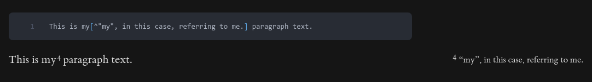
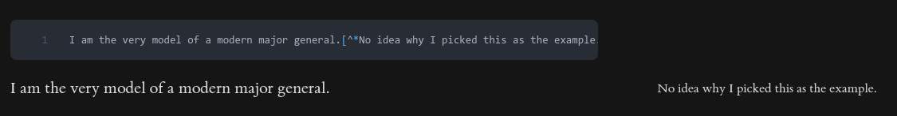
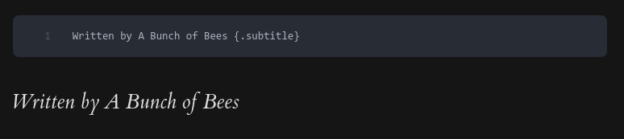
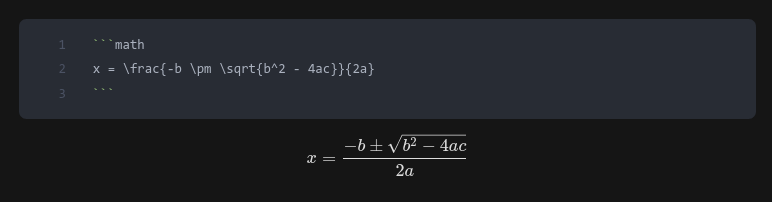
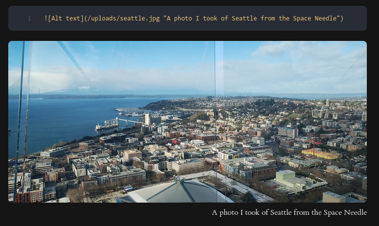
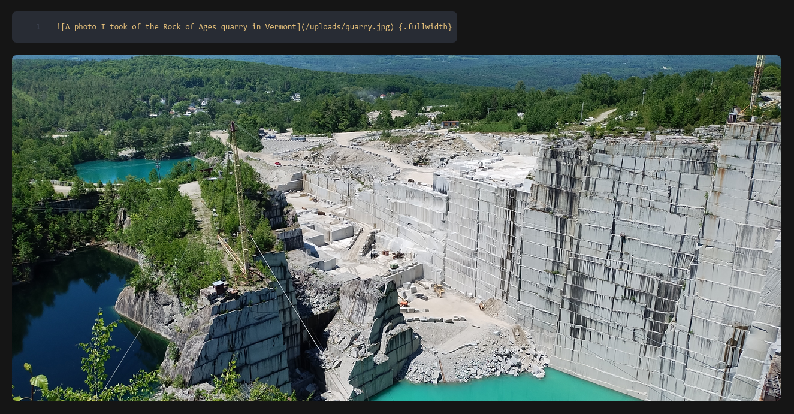
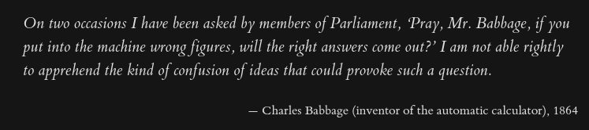
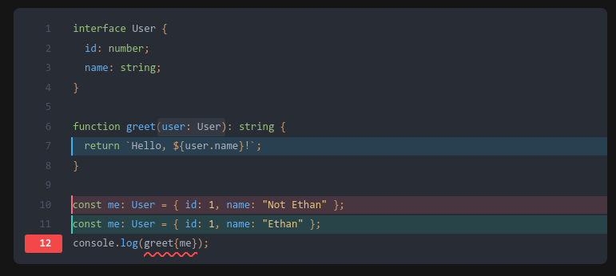
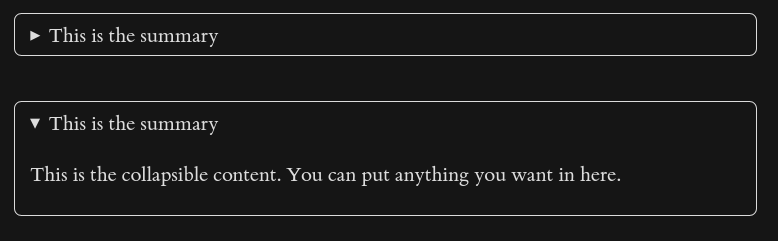

# Tufte

[](https://ethmarks.github.io/lume_tufte/)
[](https://github.com/ethmarks/lume_tufte)
[](https://www.jsdelivr.com/package/gh/ethmarks/lume_tufte)

General-purpose [Lume theme](https://lume.land/themes/) based on
[Tufte CSS](https://edwardtufte.github.io/tufte-css/).


## Features

- **Styling with Tufte CSS**: Uses a modified version of
  [Tufte CSS](https://edwardtufte.github.io/tufte-css/), a popular CSS
  micro-framework created in 2014 by
  [David Liepmann](https://github.com/daveliepmann) based on the work of
  [Edward Tufte](https://github.com/edwardtufte). Its wide margins and beautiful
  serif typography create a clean, sophisticated aesthetic.
- **Expressive Syntax**: Includes several plugins that extend standard Markdown
  syntax to allow for automatically rendering Tufte-style sidenotes, complex
  math blocks, highlighted code blocks, `<figcaption>` tags, `<details>` tags,
  and more, all without writing a single line of HTML. Includes two completely
  custom `markdown-it` plugins for perfect Tufte CSS compatibility. See the
  [Syntax section](#syntax) for more information.
- **LumeCMS Integration**: Features a comprehensive `_cms.ts` file that allows
  for no-code content management of the entire site using
  [LumeCMS](https://lume.land/cms/).

## Quickstart

Prerequisite: make sure to
[install Deno](https://docs.deno.com/runtime/getting_started/installation/) if
you haven't already.

```sh
git clone https://github.com/ethmarks/lume_tufte.git
cd lume_tufte
deno task serve
```

## Syntax

_A more in-depth guide to the Tufte theme's syntax is available
[here](https://ethmarks.github.io/lume_tufte/blog/usage/#syntax)._

### Sidenotes

Sidenotes are like
[GFM footnotes](https://docs.github.com/en/get-started/writing-on-github/getting-started-with-writing-and-formatting-on-github/basic-writing-and-formatting-syntax#footnotes),
but they're inline and the numbering is automatic. Just put the sidenote text
inside a pair of square brackets with a caret immediately following the left
bracket.

Example:

<!-- deno-fmt-ignore -->
```md
I am the very model of a modern major general.[^*No idea why I picked this as the example.]
```

Result:



### Margin notes

Margin notes are like sidenotes but without numbers. The syntax is the same but
with an asterisk after the caret.

Example:

```md
This is my[^"my", in this case, referring to me.] paragraph text.
```

Result:



### Subtitles

Subtitles are text that is italic and has a large font size. You can turn any
paragraph text into a subtitle by adding `{.subtitle}` to the end of the line.

Example:

```md
Written by A Bunch of Bees {.subtitle}
```

Result:



### Math

Math is rendered using KaTeX, which uses the same syntax as TeX. A list of KaTeX
syntax is available [here](https://katex.org/docs/supported). You can start a
math block by using the `math` language in a code block.

Example:

````md
```math
x = \frac{-b \pm \sqrt{b^2 - 4ac}}{2a}
```
````

Result:



### Figcaptions

`<figcaption>` tags are added using
[image title syntax](https://www.markdownlang.com/basic/images.html#images-with-title).
Just add quotes after the source URI.

Example:

```md

```

Result:



### Fullwidth

On wide screens, the main content only occupies 55% of the screen width. To make
an element take up more space, add `{.fullwidth}` to the end of the line.

Example:

<!-- deno-fmt-ignore -->
```md
 {.fullwidth}
```

Result:



### Epigraphs

To use
[Tufte CSS epigraphs](https://edwardtufte.github.io/tufte-css/#epigraphs), add
`{.epigraph}` to the end of a blockquote and add `{.quotecite}` to the next
paragraph text.

Example:

```md
> On two occasions I have been asked by members of Parliament, 'Pray, Mr.
> Babbage, if you put into the machine wrong figures, will the right answers
> come out?' I am not able rightly to apprehend the kind of confusion of ideas
> that could provoke such a question. {.epigraph}

— Charles Babbage (inventor of the automatic calculator), 1864 {.quotecite}
```

Result:



### Code

You can use Nueglow's
[special syntax](https://nuejs.org/docs/syntax-highlighting) for highlighting
specific sequences and lines.

To highlight a section, surround it with single bullet markers (e.g.
•important•). To underline a section, surround it with double bullet markers
(e.g. ••mistake••). To highlight an entire line, begin it with a greater than
sign (>). To render a diff, use plus signs (+) and minus signs (-) to start
inserted and deleted lines, respectively.

Example:

````md
```ts
interface User {
  id: number;
  name: string;
}

function greet(•user: User•): string {
> return `Hello, ${user.name}!`;
}

-const me: User = { id: 1, name: "Not Ethan" };
+const me: User = { id: 1, name: "Ethan" };
console.log(••greet{me}••);
```
````

Result:



### Collapsibles

To add `<details>` tags, use the
[markdown-it-collapsible](https://npmjs.com/package/markdown-it-collapsible)
syntax. It’s very similar to the code block syntax, except you use plus signs
instead of backticks.

Example:

```md
+++This is the summary

This is the collapsible content. You can put anything you want in here.

+++
```

Result (shown in collapsed form and in expanded form):



## Acknowledgements

- Thanks to [David Liepmann](https://github.com/daveliepmann) and
  [Edward Tufte](https://github.com/edwardtufte) for making
  [tufte.css](https://github.com/edwardtufte/tufte-css).
- Thanks to [Óscar Otero](https://github.com/oscarotero) for making the
  incredible SSG [Lume](https://lume.land/) and for making 9 of the 13 external
  plugins that the Tufte theme uses.
- Thanks to the respective authors of
  [markdown-it-anchor](https://www.npmjs.com/package/markdown-it-anchor) and
  [markdown-it-collapsible](https://www.npmjs.com/package/markdown-it-collapsible).

Everything else, including two of the external plugins
([lume_nueglow](https://github.com/ethmarks/lume_nueglow) and
[markdown-it-smart-media](https://jsr.io/@ethmarks/markdown-it-smart-media)) and
both of the internal plugins, was made by me.

## License

This project is under an MIT License. See [LICENSE](LICENSE) for more
information.
