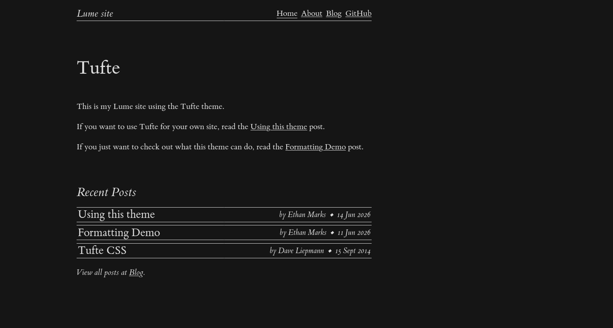
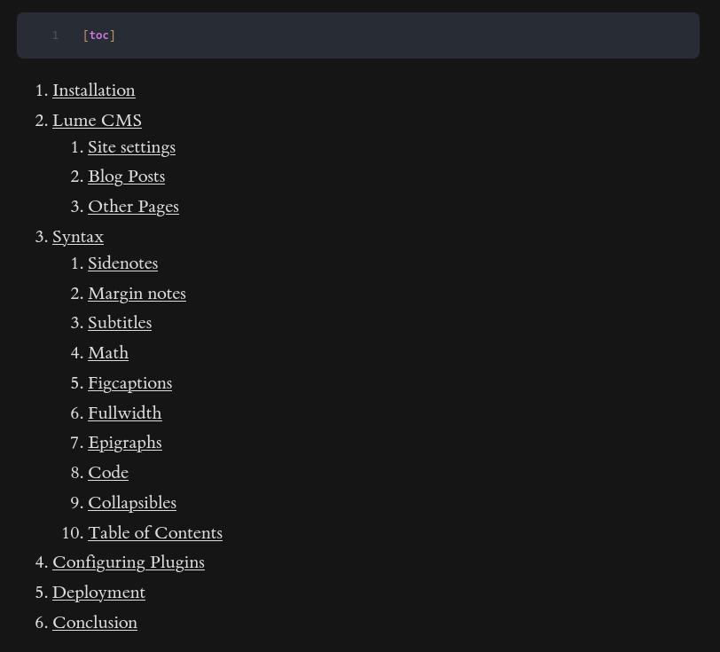

# Tufte

[](https://ethmarks.github.io/lume_tufte/)
[](https://github.com/ethmarks/lume_tufte)
[](https://www.jsdelivr.com/package/gh/ethmarks/lume_tufte)
[![Lume Theme](https://img.shields.io/badge/Lume-theme-E05252?style=flat&logo=data:image/svg+xml;base64,PHN2ZyB3aWR0aD0iNDQzIiBoZWlnaHQ9IjQ0MyIgdmlld0JveD0iMCAwIDQ0MyA0NDMiIGZpbGw9Im5vbmUiIHhtbG5zPSJodHRwOi8vd3d3LnczLm9yZy8yMDAwL3N2ZyI+PHN0eWxlPi5zaGFwZXtmaWxsOiNmZmZ9PC9zdHlsZT48cGF0aCBmaWxsPSIjZDA2YjU3IiBkPSJNMjgxLjc3NyAyNTUuNWMwIDY3LjEwMy02MC41IDEyMS41LTYwLjUgMTIxLjVzLTYwLjUtNTQuMzk3LTYwLjUtMTIxLjUgNjAuNS0xMjEuNSA2MC41LTEyMS41IDYwLjUgNTQuMzk3IDYwLjUgMTIxLjUiLz48cGF0aCBjbGFzcz0ic2hhcGUiIGQ9Ik0zNDcuMDggMTY4LjE4NmM0My4xMzIgNTEuNDAzIDMxLjc1MyAxMzEuOTYzIDMxLjc1MyAxMzEuOTYzcy04MS4zMTItMi43ODItMTI0LjQ0NS01NC4xODZTMjIyLjYzNSAxMTQgMjIyLjYzNSAxMTRzODEuMzEyIDIuNzgyIDEyNC40NDUgNTQuMTg2Ii8+PHBhdGggY2xhc3M9InNoYXBlIiBkPSJNMTg4LjE2NyAyNDUuOTYzYy00My4xMzMgNTEuNDA0LTEyNC40NDQgNTQuMTg2LTEyNC40NDQgNTQuMTg2cy0xMS4zOC04MC41NiAzMS43NTMtMTMxLjk2M0MxMzguNjA4IDExNi43ODIgMjE5LjkyIDExNCAyMTkuOTIgMTE0czExLjM4IDgwLjU1OS0zMS43NTMgMTMxLjk2M00xNjQuODc4IDBhNDcuNSA0Ny41IDAgMCAxIDQ3LjUwMSA0Ny41MDEgNCA0IDAgMCAxLTggMCAzOS41IDM5LjUgMCAwIDAtMzAuMDQxLTM4LjM1Yy4wMjMuMjguMDM5LjU2My4wMzkuODQ5IDAgNS41MjMtNC40NzcgMTAtMTAgMTBzLTEwLTQuNDc3LTEwLTEwIDQuNDc3LTEwIDEwLTEwcS4xMzYgMCAuMjcuMDA2LjExNS0uMDA2LjIzMS0uMDA2bTExMy41MDEgMGM1LjUyMyAwIDEwIDQuNDc3IDEwIDEwcy00LjQ3NyAxMC0xMCAxMC0xMC00LjQ3Ny0xMC0xMHEuMDAxLS40MjkuMDM4LS44NDlhMzkuNSAzOS41IDAgMCAwLTE4LjQ3MSAxMC40MTggMzkuNSAzOS41IDAgMCAwLTExLjU2OSAyNy45MzIgNCA0IDAgMCAxLTggMEE0Ny41MDQgNDcuNTA0IDAgMCAxIDI3Ny44NzggMHEuMTE1IDAgLjIyOS4wMDYuMTM2LS4wMDUuMjcyLS4wMDYiLz48cGF0aCBjbGFzcz0ic2hhcGUiIGQ9Ik0yNjEuMzc3IDY1YzAgMjIuMDkxLTE3LjkwOSA3MC00MCA3MHMtNDAtNDcuOTA5LTQwLTcwIDE3LjkwOS00MCA0MC00MCA0MCAxNy45MDkgNDAgNDAiLz48Y2lyY2xlIG9wYWNpdHk9Ii42IiBjeD0iMjIxLjg3NyIgY3k9IjI3MS41IiByPSIxNzEuNSIgZmlsbD0idXJsKCNwYWludDBfcmFkaWFsXzQxXzI5MCkiLz48cGF0aCBjbGFzcz0ic2hhcGUiIGQ9Ik0xNDYuMjExIDIxNi4yNTljLTU2LjkwNiAzNS41NTktMTM1LjA5OCAxMy4wNzgtMTM1LjA5OCAxMy4wNzhzMTQuMDcyLTgwLjEzMyA3MC45NzgtMTE1LjY5MiAxMzUuMDk4LTEzLjA3OCAxMzUuMDk4LTEzLjA3OC0xNC4wNzEgODAuMTMzLTcwLjk3OCAxMTUuNjkybTIxNC41ODUtMTAyLjYxNmM1Ni45MDYgMzUuNTU5IDcwLjk3OCAxMTUuNjkyIDcwLjk3OCAxMTUuNjkycy03OC4xOTIgMjIuNDgxLTEzNS4wOTgtMTMuMDc4LTcwLjk3OC0xMTUuNjkzLTcwLjk3OC0xMTUuNjkzIDc4LjE5Mi0yMi40OCAxMzUuMDk4IDEzLjA3OSIvPjxkZWZzPjxyYWRpYWxHcmFkaWVudCBpZD0icGFpbnQwX3JhZGlhbF80MV8yOTAiIGN4PSIwIiBjeT0iMCIgcj0iMSIgZ3JhZGllbnRVbml0cz0idXNlclNwYWNlT25Vc2UiIGdyYWRpZW50VHJhbnNmb3JtPSJyb3RhdGUoOTAgLTI0LjgxMSAyNDYuNjg5KXNjYWxlKDE3MS41KSI+PHN0b3Agc3RvcC1jb2xvcj0iI2QwNmI1NyIvPjxzdG9wIG9mZnNldD0iMSIgc3RvcC1jb2xvcj0iI2QwNmI1NyIgc3RvcC1vcGFjaXR5PSIwIi8+PC9yYWRpYWxHcmFkaWVudD48L2RlZnM+PC9zdmc+&labelColor=121014)](https://lume.land/theme/tufte/)

General-purpose [Lume theme](https://lume.land/themes/) based on
[Tufte CSS](https://edwardtufte.github.io/tufte-css/).



## Features

- **Styling with Tufte CSS**: Uses a modified version of
  [Tufte CSS](https://edwardtufte.github.io/tufte-css/), a popular CSS
  micro-framework created in 2014 by
  [David Liepmann](https://github.com/daveliepmann) based on the work of
  [Edward Tufte](https://github.com/edwardtufte). Its wide margins and beautiful
  serif typography create a clean, sophisticated aesthetic.
- **Expressive Syntax**: Includes several plugins that extend standard Markdown
  syntax for things like sidenotes, complex math blocks, `<figcaption>` tags,
  and more, all without writing a single line of HTML. See the
  [Syntax section](#syntax) for more information.
- **LumeCMS Integration**: Features a comprehensive `_cms.ts` file that allows
  for no-code content management of the entire site using
  [LumeCMS](https://lume.land/cms/).
- **Perfect Lighthouse Scores**: Earns
  [perfect 100s](https://developer.chrome.com/docs/lighthouse/performance/performance-scoring#:~:text=To%20provide%20a%20good%20user,90%20to%2094.)
  in performance, accessibility, best practices, and SEO on
  [Lighthouse](https://pagespeed.web.dev/analysis?url=https%3A%2F%2Fethmarks.github.io%2Flume_tufte%2F).

## Quickstart

> [!TIP]
> **This quickstart is for creating your own Lume site using the Tufte theme. If
> you just want to check out the theme, visit the
> [live demo](https://ethmarks.github.io/lume_tufte/).**

Prerequisite: make sure to
[install Deno](https://docs.deno.com/runtime/getting_started/installation/) if
you haven't already. I'm using Deno 2.8.1, but it'll probably work on other
versions.

```sh
deno run -A https://lume.land/init.ts --theme=tufte
deno task serve
```

## How it Works

Under the hood, the Tufte theme is a Lume plugin that automatically loads a
bunch of plugins, layouts, components, and stylesheets.

### Remote Files

When you install the Tufte theme, you won't see any of its internal files in
your site. This is because the theme internals are loaded as
[remote files](https://lume.land/docs/core/remote-files/) via Lume's
`site.remote()` API. This keeps your site's repo clean while still making the
necessary theme files available to Lume.

> [!TIP]
> Because local files take precedence over remote files, you can override the
> theme internal files by creating an identically-named file in the same
> location, if you were so inclined.

### Plugins

Tufte uses 12 Lume plugins and 6 markdown-it plugins to add syntax, optimize
performance, and handle internal theme logic.

**Syntax plugins**

These plugins add syntax that you can use when writing page content. See the
[Syntax section](#syntax) for a guide.

- [katex](https://lume.land/plugins/katex/): renders math blocks.
- [nueglow](https://github.com/ethmarks/lume_nueglow): highlights code blocks.
- [markdown](https://lume.land/plugins/markdown/): already installed by default,
  but we need to explicitly add it in order to add our own markdown-it plugins.
- [markdown-it-anchor](https://github.com/valeriangalliat/markdown-it-anchor):
  adds `id` attributes to headings so that you can use
  [URI fragments](https://developer.mozilla.org/en-US/docs/Web/URI/Reference/Fragment).
- [markdown-it-collapsible](https://www.npmjs.com/package/markdown-it-collapsible):
  adds syntax for collapsibles.
- [markdown-it-toc-done-right](https://github.com/nagaozen/markdown-it-toc-done-right):
  adds syntax for tables of content.
- [markdown-it-smart-media](https://github.com/ethmarks/markdown-it-smart-media):
  adds syntax for videos, audio, and figcaptions.
- [markdown-it-tufte-sections](./mdit/tufte-sections.ts): custom plugin that
  automatically wraps page content in `<section>` tags based on headings,
  [as Tufte CSS requires](https://edwardtufte.github.io/tufte-css/#fundamentals--sections-and-headers:~:text=use%20section%20tags%20around%20each%20logical%20grouping%20of%20text%20and%20headings.).
- [markdown-it-tufte-notes](./mdit/tufte-notes.ts): custom plugin that adds
  syntax for Tufte-style sidenotes and margin notes.

**Optimization/SEO plugins**

These plugins are used to make pages load faster, improve SEO, or other
invisible-but-important things. 100s in every category on Lighthouse doesn't
just _happen_, you know.

- [imageSize](https://lume.land/plugins/image_size/): adds `width` and `height`
  attributes to images to prevent [layout shifts](https://web.dev/articles/cls)
  on page load.
- [sitemap](https://lume.land/plugins/sitemap/): generates the
  [sitemap](https://developers.google.com/search/docs/crawling-indexing/sitemaps/overview).
- [feed](https://lume.land/plugins/feed/): generates the RSS feed.
- [favicon](https://lume.land/plugins/favicon/): optimizes the favicon and
  converts it to different formats.
- Though it's not a plugin, the
  [`fontPreloads.vto` component](./src/_components/fontPreloads.vto) definitely
  fits in this category. It selectively preloads _only_ the font files that each
  page uses. This prevents
  [FOUT](https://fonts.google.com/knowledge/glossary/fout) without adding unused
  global preloads.

**Internal plugins**

These plugins are used to make other parts of the theme work.

- [sass](https://lume.land/plugins/sass/): transpiles the SCSS stylesheets into
  browser-consumable CSS files.
- [basePath](https://lume.land/plugins/base_path/): prefixes relative URLs (e.g.
  `/about`) with a subpath, which allows the site to be deployed on services
  like GitHub Pages.
- [metas](https://lume.land/plugins/metas/): adds `<meta>` tags to the `<head>`
  of each page for things like titles, descriptions, and the favicon.
- [readingInfo](https://lume.land/plugins/reading_info/): counts the words of
  each page, which is used in the blogList component's post info.
- [search](https://lume.land/plugins/search/): allows layouts to query and
  filter pages, which is used in the blogList component to list the posts.

## Syntax

_A more in-depth guide to the Tufte theme's syntax is available
[here](https://ethmarks.github.io/lume_tufte/blog/usage/#syntax)._

### Sidenotes

Sidenotes are like
[GFM footnotes](https://docs.github.com/en/get-started/writing-on-github/getting-started-with-writing-and-formatting-on-github/basic-writing-and-formatting-syntax#footnotes),
but they're inline and the numbering is automatic. Just put the sidenote text
inside a pair of square brackets with a caret immediately following the left
bracket.

Example:

```md
This is my[^"my", in this case, referring to me.] paragraph text.
```

Result:


### Margin notes

Margin notes are like sidenotes but without numbers. The syntax is the same but
with an asterisk after the caret.

Example:

<!-- deno-fmt-ignore -->
```md
I am the very model of a modern major general.[^*No idea why I picked this as the example.]
```

Result:


### Subtitles

Subtitles are text that is italic and has a large font size. You can turn any
paragraph text into a subtitle by adding `{.subtitle}` to the end of the line.

Example:

```md
Written by A Bunch of Bees {.subtitle}
```

Result:


### Math

Math is rendered using KaTeX, which uses the same syntax as TeX. A list of KaTeX
syntax is available [here](https://katex.org/docs/supported). You can start a
math block by using the `math` language in a code block.

Example:

````md
```math
x = \frac{-b \pm \sqrt{b^2 - 4ac}}{2a}
```
````

Result:


### Figcaptions

`<figcaption>` tags are added using
[image title syntax](https://www.markdownlang.com/basic/images.html#images-with-title).
Just add quotes after the source URI.

Example:

```md

```

Result:


### Fullwidth

On wide screens, the main content only occupies 55% of the screen width. To make
an element take up more space, add `{.fullwidth}` to the end of the line.

Example:

<!-- deno-fmt-ignore -->
```md
 {.fullwidth}
```

Result:


### Epigraphs

To use
[Tufte CSS epigraphs](https://edwardtufte.github.io/tufte-css/#epigraphs), add
`{.epigraph}` to the end of a blockquote and add `{.quotecite}` to the next
paragraph text.

Example:

```md
> On two occasions I have been asked by members of Parliament, 'Pray, Mr.
> Babbage, if you put into the machine wrong figures, will the right answers
> come out?' I am not able rightly to apprehend the kind of confusion of ideas
> that could provoke such a question. {.epigraph}

— Charles Babbage (inventor of the automatic calculator), 1864 {.quotecite}
```

Result:


### Code

You can use Nueglow's
[special syntax](https://nuejs.org/docs/syntax-highlighting) for highlighting
specific sequences and lines.

To highlight a section, surround it with single bullet markers (e.g.
•important•). To underline a section, surround it with double bullet markers
(e.g. ••mistake••). To highlight an entire line, begin it with a greater than
sign (>). To render a diff, use plus signs (+) and minus signs (-) to start
inserted and deleted lines, respectively.

Example:

````md
```ts
interface User {
  id: number;
  name: string;
}

function greet(•user: User•): string {
> return `Hello, ${user.name}!`;
}

-const me: User = { id: 1, name: "Not Ethan" };
+const me: User = { id: 1, name: "Ethan" };
console.log(••greet{me}••);
```
````

Result:


### Collapsibles

To add `<details>` tags, use the
[markdown-it-collapsible](https://npmjs.com/package/markdown-it-collapsible)
syntax. It’s very similar to the code block syntax, except you use plus signs
instead of backticks.

Example:

```md
+++This is the summary

This is the collapsible content. You can put anything you want in here.

+++
```

Result (shown in collapsed form and in expanded form):


### Table of Contents

To add a table of contents, use the syntax from
[markdown-it-toc-done-right](https://github.com/nagaozen/markdown-it-toc-done-right):
place any of `${toc}`, `[[toc]]`, `[toc]`, or `[[_toc_]]` anywhere on a page and
the plugin will automatically replace it with a table of contents based on your
headings.

Example:

```md
[toc]
```

Result:



## Showcase

Here are all the sites that I'm aware of that use the Tufte theme. If your site
uses the Tufte theme and you'd like it to be featured here, feel absolutely free
to open a PR!

- [Lume Tufte Theme Demo](https://ethmarks.github.io/lume_tufte/) (obviously)
- [Lume Nueglow Plugin Demo](https://ethmarks.github.io/lume_nueglow/)

## Acknowledgements

- Thanks to [David Liepmann](https://github.com/daveliepmann) and
  [Edward Tufte](https://github.com/edwardtufte) for making
  [tufte.css](https://github.com/edwardtufte/tufte-css).
- Thanks to [Óscar Otero](https://github.com/oscarotero) for making the
  incredible SSG [Lume](https://lume.land/) and for making 11 of the 16 external
  plugins that the Tufte theme uses.
- Thanks to the respective authors of
  [markdown-it-anchor](https://github.com/valeriangalliat/markdown-it-anchor),
  [markdown-it-collapsible](https://www.npmjs.com/package/markdown-it-collapsible),
  and
  [markdown-it-toc-done-right](https://github.com/nagaozen/markdown-it-toc-done-right).

Everything else, including two of the external plugins
([lume_nueglow](https://github.com/ethmarks/lume_nueglow) and
[markdown-it-smart-media](https://jsr.io/@ethmarks/markdown-it-smart-media)) and
both of the internal mdit plugins ([tufte-notes](./mdit/tufte-notes.ts) and
[tufte-sections](./mdit/tufte-sections.ts)), was made by me.

## License

This project is under an MIT License. See [LICENSE](LICENSE) for more
information.
